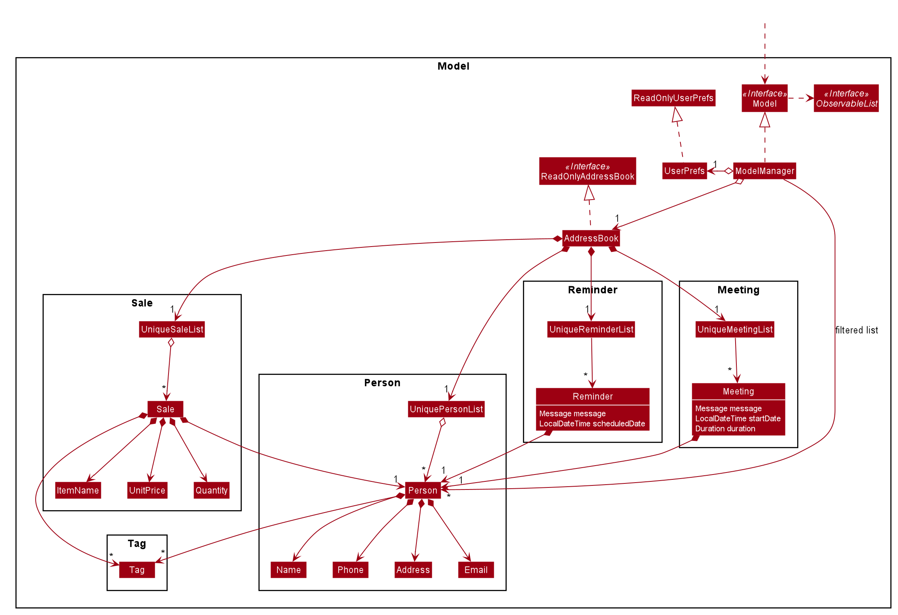
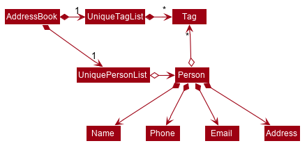
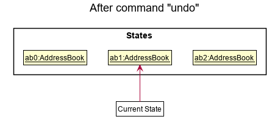
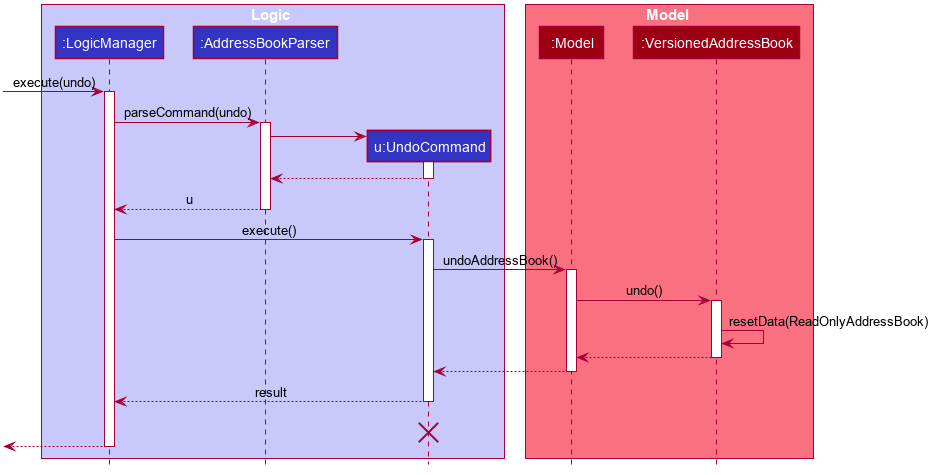
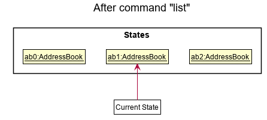
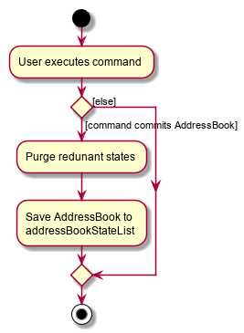

* Table of Contents
{:toc}

--------------------------------------------------------------------------------------------------------------------

## **Setting up, getting started**

Refer to the guide [_Setting up and getting started_](SettingUp.md).

--------------------------------------------------------------------------------------------------------------------

## **Design**

### Architecture

The ***Architecture Diagram*** given above explains the high-level design of the App. Given below is a quick overview of each component.

:bulb: **Tip:** The `.puml` files used to create diagrams in this document can be found in the [diagrams](https://github.com/AY2021S1-CS2103T-T11-1/tp/blob/master/docs/diagrams/) folder. Refer to the [_PlantUML Tutorial_ at se-edu/guides](https://se-education.org/guides/tutorials/plantUml.html) to learn how to create and edit diagrams.

**`Main`** has two classes called [`Main`](https://github.com/AY2021S1-CS2103T-T11-1/tp/blob/master/src/main/java/seedu/address/Main.java) and [`MainApp`](https://github.com/AY2021S1-CS2103T-T11-1/tp/blob/master/src/main/java/seedu/address/MainApp.java). It is responsible for,
* At app launch: Initializes the components in the correct sequence, and connects them up with each other.
* At shut down: Shuts down the components and invokes cleanup methods where necessary.

[**`Commons`**](#common-classes) represents a collection of classes used by multiple other components.

The rest of the App consists of four components.

* [**`UI`**](#ui-component): The UI of the App.
* [**`Logic`**](#logic-component): The command executor.
* [**`Model`**](#model-component): Holds the data of the App in memory.
* [**`Storage`**](#storage-component): Reads data from, and writes data to, the hard disk.

Each of the four components,

* defines its *API* in an `interface` with the same name as the Component.
* exposes its functionality using a concrete `{Component Name}Manager` class (which implements the corresponding API `interface` mentioned in the previous point.

For example, the `Logic` component (see the class diagram given below) defines its API in the `Logic.java` interface and exposes its functionality using the `LogicManager.java` class which implements the `Logic` interface.

**How the architecture components interact with each other**

The *Sequence Diagram* below shows how the components interact with each other for the scenario where the user issues the command `delete 1`.

The sections below give more details of each component.

### UI component

**API** :
[`Ui.java`](https://github.com/AY2021S1-CS2103T-T11-1/tp/blob/master/src/main/java/seedu/address/ui/Ui.java)

The UI consists of a `MainWindow` that is made up of parts e.g.`CommandBox`, `ResultDisplay`, `PersonListPanel`, `StatusBarFooter` etc. All these, including the `MainWindow`, inherit from the abstract `UiPart` class.

The `UI` component uses JavaFx UI framework. The layout of these UI parts are defined in matching `.fxml` files that are in the `src/main/resources/view` folder. For example, the layout of the [`MainWindow`](https://github.com/AY2021S1-CS2103T-T11-1/tp/blob/master/src/main/java/seedu/address/ui/MainWindow.java) is specified in [`MainWindow.fxml`](https://github.com/AY2021S1-CS2103T-T11-1/tp/blob/master/src/main/resources/view/MainWindow.fxml)

The `UI` component,

* Executes user commands using the `Logic` component.
* Listens for changes to `Model` data so that the UI can be updated with the modified data.

### Logic component

**API** :
[`Logic.java`](https://github.com/AY2021S1-CS2103T-T11-1/tp/blob/master/src/main/java/seedu/address/logic/Logic.java)

1. `Logic` uses the `StonksBookParser` class to parse the user command.
1. This results in a `Command` object which is executed by the `LogicManager`.
1. The command execution can affect the `Model` (e.g. adding a person).
1. The result of the command execution is encapsulated as a `CommandResult` object which is passed back to the `Ui`.
1. In addition, the `CommandResult` object can also instruct the `Ui` to perform certain actions, such as displaying help to the user.

Given below is the Sequence Diagram for interactions within the `Logic` component for the `execute("delete 1")` API call.

:information_source: **Note:** The lifeline for `DeleteCommandParser` should end at the destroy marker (X) but due to a limitation of PlantUML, the lifeline reaches the end of diagram.

### Model component

**API** : [`Model.java`](https://github.com/AY2021S1-CS2103T-T11-1/tp/blob/master/src/main/java/seedu/address/model/Model.java)

The `Model`,

* stores a `UserPref` object that represents the user’s preferences.
* stores the address book data.
* exposes an unmodifiable `ObservableList<Person>` that can be 'observed' e.g. the UI can be bound to this list so that the UI automatically updates when the data in the list change.
* does not depend on any of the other three components.

:information_source: **Note:** An alternative (arguably, a more OOP) model is given below. It has a `Tag` list in the `StonksBook`, which `Person` references. This allows `StonksBook` to only require one `Tag` object per unique `Tag`, instead of each `Person` needing their own `Tag` object. 

### Storage component

**API** : [`Storage.java`](https://github.com/AY2021S1-CS2103T-T11-1/tp/blob/master/src/main/java/seedu/address/storage/Storage.java)

The `Storage` component,
* can save `UserPref` objects in json format and read it back.
* can save the address book data in json format and read it back.

### Common classes

Classes used by multiple components are in the `seedu.StonksBook.commons` package.

--------------------------------------------------------------------------------------------------------------------

## **Implementation**

This section describes some noteworthy details on how certain features are implemented.

### \[Proposed\] Undo/redo feature

#### Proposed Implementation

The proposed undo/redo mechanism is facilitated by `VersionedStonksBook`. It extends `StonksBook` with an undo/redo history, stored internally as an `StonksBookStateList` and `currentStatePointer`. Additionally, it implements the following operations:

* `VersionedStonksBook#commit()` — Saves the current address book state in its history.
* `VersionedStonksBook#undo()` — Restores the previous address book state from its history.
* `VersionedStonksBook#redo()` — Restores a previously undone address book state from its history.

These operations are exposed in the `Model` interface as `Model#commitStonksBook()`, `Model#undoStonksBook()` and `Model#redoStonksBook()` respectively.

Given below is an example usage scenario and how the undo/redo mechanism behaves at each step.

Step 1. The user launches the application for the first time. The `VersionedStonksBook` will be initialized with the initial address book state, and the `currentStatePointer` pointing to that single address book state.

Step 2. The user executes `delete 5` command to delete the 5th person in the address book. The `delete` command calls `Model#commitStonksBook()`, causing the modified state of the address book after the `delete 5` command executes to be saved in the `StonksBookStateList`, and the `currentStatePointer` is shifted to the newly inserted address book state.

Step 3. The user executes `add n/David …​` to add a new person. The `add` command also calls `Model#commitStonksBook()`, causing another modified address book state to be saved into the `StonksBookStateList`.

:information_source: **Note:** If a command fails its execution, it will not call `Model#commitStonksBook()`, so the address book state will not be saved into the `StonksBookStateList`.

Step 4. The user now decides that adding the person was a mistake, and decides to undo that action by executing the `undo` command. The `undo` command will call `Model#undoStonksBook()`, which will shift the `currentStatePointer` once to the left, pointing it to the previous address book state, and restores the address book to that state.

:information_source: **Note:** If the `currentStatePointer` is at index 0, pointing to the initial StonksBook state, then there are no previous StonksBook states to restore. The `undo` command uses `Model#canUndoStonksBook()` to check if this is the case. If so, it will return an error to the user rather
than attempting to perform the undo.

The following sequence diagram shows how the undo operation works:

:information_source: **Note:** The lifeline for `UndoCommand` should end at the destroy marker (X) but due to a limitation of PlantUML, the lifeline reaches the end of diagram.

The `redo` command does the opposite — it calls `Model#redoStonksBook()`, which shifts the `currentStatePointer` once to the right, pointing to the previously undone state, and restores the address book to that state.

:information_source: **Note:** If the `currentStatePointer` is at index `StonksBookStateList.size() - 1`, pointing to the latest address book state, then there are no undone StonksBook states to restore. The `redo` command uses `Model#canRedoStonksBook()` to check if this is the case. If so, it will return an error to the user rather than attempting to perform the redo.

Step 5. The user then decides to execute the command `list`. Commands that do not modify the address book, such as `list`, will usually not call `Model#commitStonksBook()`, `Model#undoStonksBook()` or `Model#redoStonksBook()`. Thus, the `StonksBookStateList` remains unchanged.

Step 6. The user executes `clear`, which calls `Model#commitStonksBook()`. Since the `currentStatePointer` is not pointing at the end of the `StonksBookStateList`, all address book states after the `currentStatePointer` will be purged. Reason: It no longer makes sense to redo the `add n/David …​` command. This is the behavior that most modern desktop applications follow.

The following activity diagram summarizes what happens when a user executes a new command:

#### Design consideration:

##### Aspect: How undo & redo executes

* **Alternative 1 (current choice):** Saves the entire address book.
  * Pros: Easy to implement.
  * Cons: May have performance issues in terms of memory usage.

* **Alternative 2:** Individual command knows how to undo/redo by
  itself.
  * Pros: Will use less memory (e.g. for `delete`, just save the person being deleted).
  * Cons: We must ensure that the implementation of each individual command are correct.

_{more aspects and alternatives to be added}_

### \[Proposed\] Data archiving

_{Explain here how the data archiving feature will be implemented}_

--------------------------------------------------------------------------------------------------------------------

## **Documentation, logging, testing, configuration, dev-ops**

* [Documentation guide](Documentation.md)
* [Testing guide](Testing.md)
* [Logging guide](Logging.md)
* [Configuration guide](Configuration.md)
* [DevOps guide](DevOps.md)

--------------------------------------------------------------------------------------------------------------------

## **Appendix: Requirements**

### Product scope

**Target user profile**:

* Managing a large client base
* Values sales optimisation
*  Analytical
*  Performance-driven
* prefer desktop apps over other types
* can type fast
* prefers typing to mouse interactions
* is reasonably comfortable using CLI apps

**Value proposition**: Effectively curate sales-optimised contact list and conveniently conduct data analysis to gain business insights and boost sales performance.

### User stories

Priorities: High (must have) - `* * *`, Medium (nice to have) - `* *`, Low (unlikely to have) - `*`

| Priority | As a …​                        | I want to …​                                               | So that I can…​                                                                            |
| -------- | --------------------------------- | ------------------------------------------------------------- | --------------------------------------------------------------------------------------------- |
| `* *`    | well-connected salesman           | see a history of the number of contacts made with someone     | determine if this contact is worth investing more time to                                     |
| `* *`    | forgetful salesman                | set reminders associated with contacts                        | keep track of crucial tasks to be done                                                        |
| `* *`    | efficient salesman                | set meeting / call time with contacts                         | plan my meetings without another app                                                          |
| `* * *`  | new salesman                      | add more contacts                                             | expand my contact list                                                                        |
| `* *`    | normal user who makes mistakes    | update contacts                                               | quickly and conveniently append any mistakes made.                                            |
| `* * *`  | careless user                     | delete contacts                                               | avoid having wrong data                                                                       |
| `* *`    | visual salesman                   | have chatbot GUI                                              | visually keep track of my actions                                                             |
| `* *`    | busy salesman                     | clear past interactions with the app (like CLI clear command) | remove the clutter on the GUI                                                                 |
| `* *`    | careless typer                    | be notified of an erroneous input                             | easily identify my mistakes                                                                   |
| `* *`    | well-connected salesman           | associate notes to contacts                                   | remember key information about this contact and distinguish between contacts with same names  |
| `* *`    | organised user                    | get notified if I attempted to create a duplicate record      | avoid duplicated contacts in the app.                                                         |
| `* *`    | efficient salesman                | see the relevant sales information to the contact information | make sales decisions without referring to other app                                           |
| `* * *`  | well-connected salesman           | categorise my contacts                                        | navigate through a large list of contacts with ease.                                          |
| `* *`    | efficient salesman                | search contacts who are in certain groups                     | identify contacts belong to a sales group easily                                              |
| `* *`    | well-connected salesman           | search for contacts or records based on fuzzy match           | easily find the contacts I am interested in                                                   |
| `* *`    | forgetful salesman                | see the command list with a single command                    | easily recall how to use the app                                                              |
| `* * *`  | efficient salesman                | add sales to contacts                                          | make better sales decisions to my clients                                                    |
| `* * *`  | salesman                          | delete sales belonging to contacts                            | ensure updated and correct sales information                                                  |
| `* * *`  | efficient salesman                | list all sales of a contact                                   | see all sales made to a contact easily                                                        |
| `* *`    | careless user                     | be notified if a similar record already exists                | ensure no duplicate records are created                                                       |

### Use cases

(For all use cases below, the **System** is the `StonksBook` and the **Actor** is the `user`, unless specified otherwise)

**Use case: Delete a person**

**MSS**

1.  User requests to list persons
2.  StonksBook shows a list of persons
3.  User requests to delete a specific person in the list
4.  StonksBook deletes the person

  Use case ends.

**Extensions**

* 2a. The list is empty.

  Use case ends.

* 3a. The given index is invalid.

    * 3a1. StonksBook shows an error message.

      Use case resumes at step 2.

**Use case: Add a tag**

**MSS**

1.  User requests to add a new tag.
2.  StonksBook adds the provided tag.

    Use case ends.

**Extensions**

* 2a. The provided tag already exists in the tag list.

    Use case ends.

**Use case: View all tags**

**MSS**

1.  User requests to list all tags.
2.  StonksBook displays a list of all tags.

    Use case ends.

**Extensions**

* 2a. The list of tags is empty.

    Use case ends.

**Use case: Update a tag**

**MSS**

1.  User requests to list tags.
2.  StonksBook shows a list of tags.
3.  User requests to update a specific tag in the list.
4.  StonksBook requests for confirmation.
5.  User confirms.
6.  StonksBook updates the tag and updates all items associated with this tag.

    Use case ends.

**Extensions**

* 2a. The list of tags is empty.

    Use case ends.

* 3a. The given index is invalid.

    * 3a1. StonksBook shows an error message.

        Use case resumes at step 2.

**Use case: Delete a tag**

**MSS**

1.  User requests to list tags.
2.  StonksBook shows a list of tags.
3.  User requests to delete a specific tag in the list.
4.  StonksBook requests for confirmation.
5.  User confirms.
6.  StonksBook deletes the tag and updates all items associated with this tag.

    Use case ends.

**Extensions**

* 2a. The list of tags is empty.

    Use case ends.

* 3a. The given index is invalid.

    * 3a1. StonksBook shows an error message.

        Use case resumes at step 2.

**Use case: Retrieve entries by tag**

**MSS**

1.  User requests to list tags.
2.  StonksBook shows a list of tags.
3.  User requests to search for items under a specific tag in the list.
4.  StonksBook displays all entries under the given tag.

    Use case ends.

**Extensions**

* 2a. The list of tags is empty.

    Use case ends.

* 3a. The given index is invalid.

    * 3a1. StonksBook shows an error message.

        Use case resumes at step 2.

**Use case: Clear past interactions**

**MSS**
1.  User enters the clear command.
2.  StonksBook clears the chatbox GUI.

    Use case ends.

**Use case: Clear all data**

**MSS**
1.  User enters the purge command.
2.  StonksBook clears all saved data.

    Use case ends.

**Extensions**
* 1a. StonksBook requests for confirmation.
    * 1a1. User confirms.

        Use case resumes at step 2. 
        
**Use case: Find a contact**

**MSS**

1.  User requests to find a contact by giving keyword(s).
2.  StonksBook outputs a contact list.

    Use case ends.

**Extensions**

* 2a. The list is empty.

  Use case ends.

* 2b. There is no given keyword.

    * 3a1. StonksBook shows an error message.

      Use case ends.
      
**Use case: Add an appointment**

**MSS**

1. User requests to list contacts
2. StonksBook shows a list of contacts
3. User requests to add an appointment associated with a specific contact in the list
4. StonksBook adds a appointment associated with the contact

  Use case ends.

**Extensions**

* 2a. The list of contacts is empty.

  Use case ends.

* 3a. The given index is invalid.

    * 3a1. StonksBook shows an error message.

      Use case resumes at step 2.
      
* 3b. The given appointment date is invalid.

    * 3b1. StonksBook shows an error message.

      Use case resumes at step 2.
      
* 3c. The given appointment duration is invalid.

    * 3b1. StonksBook shows an error message.

      Use case resumes at step 2.

**Use case: View all appointments**

**MSS**

1. User requests to list all appointments
2. StonksBook shows a list of all appointments

  Use case ends.

**Extensions**

* 1a. A index is specified, but the given index is invalid

    * 1a1. StonksBook shows an error message.

      Use case resumes at step 1.

* 2a. The list of appointments is empty.

  Use case ends.

**Use case: Delete an appointment**

**MSS**

1. User requests to list appointments
2. StonksBook shows a list of appointments
3. User requests to delete a specific appointment in the list
4. StonksBook deletes the appointment

  Use case ends.

**Extensions**

* 2a. The list of appointments is empty.

  Use case ends.

* 3a. The given index is invalid.

    * 3a1. StonksBook shows an error message.

      Use case resumes at step 2.
      
**Use case: Add a reminder**

**MSS**

1. User requests to list contacts
2. StonksBook shows a list of contacts
3. User requests to add a reminder associated with a specific contact in the list
4. StonksBook adds a reminder associated with the contact

  Use case ends.
  
**Extensions**

* 2a. The list of contacts is empty.

  Use case ends.
  
* 3a. The given index is invalid.

    * 3a1. StonksBook shows an error message.

      Use case resumes at step 2.
      
* 3b. The given reminder date is invalid.

    * 3b1. StonksBook shows an error message.

      Use case resumes at step 2.

**Use case: View all reminders**

**MSS**

1. User requests to list all reminders
2. StonksBook shows a list of all reminders

  Use case ends.

**Extensions**

* 2a. The list of reminders is empty.

  Use case ends.

**Use case: Delete a reminder**

**MSS**

1. User requests to list reminders
2. StonksBook shows a list of reminders
3. User requests to delete a specific reminder in the list
4. StonksBook deletes the reminder

  Use case ends.

**Extensions**

* 2a. The list of reminders is empty.

  Use case ends.

* 3a. The given index is invalid.

    * 3a1. StonksBook shows an error message.

      Use case resumes at step 2.
      
**Use case: Get help on available commands**

**MSS**

1.  User requests for help on the available commands.
2.  StonksBook lists the available commands, command description and example usage as well as the link to the User Guide.

    Use case ends.

**Use case: Get help for a command**

**MSS**

1.  User requests for help for a command.
2.  StonksBook lists the command description and example usage.

  Use case ends.

**Use case: Add a sale to a contact**

**MSS**

1.  User requests to list contacts.
2.  StonksBook shows a list of contacts.
3.  User requests to add a sale to a specific contact in the list.
4.  StonksBook adds a sale to the specific contact.

    Use case ends.

**Extensions**

* 2a. The list of contacts is empty.

  Use case ends.

* 3a. The given contact index is invalid.

    * 3a1. StonksBook shows an error message.

      Use case resumes at step 2.

* 4a. The given sale already exists

    * 4a1. StonksBook shows an error message.
    
      Use case ends.
    
* 5a. The given parameters (unit price and quantity) are not in the correct format.

    * 5a1. StonksBook shows an error message.
    
      Use case resumes at step 2.

**Use case: List all sales belonging to a contact**

**MSS**

1.  User requests to list contacts.
2.  StonksBook shows a list of contacts.
3.  User requests to view all sales belonging to a specific contact in the list.
4.  StonksBook shows all sales belonging to the specific contact.

    Use case ends.

**Extensions**

* 2a. The list of contacts is empty.

  Use case ends.

* 3a. The given contact index is invalid.

    * 3a1. StonksBook shows an error message.

      Use case resumes at step 2.

**Use case: Delete a sale belonging to a contact**

**MSS**

1.  User requests to list contacts.
2.  StonksBook shows a list of contacts.
3.  User requests to delete a sale belonging to a specific contact in the list.
4.  StonksBook deletes the specified sale.

    Use case ends.

**Extensions**

* 2a. The list of contacts is empty.

  Use case ends.
  
* 3a. The list of sales is empty.

  Use case ends.

* 4a. The given contact index or sale index is invalid.

    * 4a1. StonksBook shows an error message.

      Use case resumes at step 2.

### Non-Functional Requirements

1.  Should work on any _mainstream OS_ as long as it has Java `11` or above installed.
2.  Should be able to hold up to 1000 persons without a noticeable sluggishness in performance for typical usage.
3.  A user with above average typing speed for regular English text (i.e. not code, not system admin commands) should be able to accomplish most of the tasks faster using commands than using the mouse.
4.  The size of the application should not exceed 100Mb.
5.  The features of the application should be easily testable.
6.  The application, along with all my existing data, should be portable.
7.  Should be able to function without having to rely on being connected to a network.
8.  The data should be stored locally and should be in a human editable text file.

### Glossary

* **Mainstream OS**: Windows, Linux, Unix, OS-X
* **Private contact detail**: A contact detail that is not meant to be shared with others

--------------------------------------------------------------------------------------------------------------------

## **Appendix: Instructions for manual testing**

Given below are instructions to test the app manually.

:information_source: **Note:** These instructions only provide a starting point for testers to work on;
testers are expected to do more *exploratory* testing.

### Launch and shutdown

1. Initial launch

   1. Download the jar file and copy into an empty folder

   1. Double-click the jar file Expected: Shows the GUI with a set of sample contacts. The window size may not be optimum.

1. Saving window preferences

   1. Resize the window to an optimum size. Move the window to a different location. Close the window.

   1. Re-launch the app by double-clicking the jar file. 
       Expected: The most recent window size and location is retained.

1. _{ more test cases …​ }_

### Deleting a person

1. Deleting a person while all persons are being shown

   1. Prerequisites: List all persons using the `list` command. Multiple persons in the list.

   1. Test case: `delete 1` 
      Expected: First contact is deleted from the list. Details of the deleted contact shown in the status message. Timestamp in the status bar is updated.

   1. Test case: `delete 0` 
      Expected: No person is deleted. Error details shown in the status message. Status bar remains the same.

   1. Other incorrect delete commands to try: `delete`, `delete x`, `...` (where x is larger than the list size) 
      Expected: Similar to previous.

1. _{ more test cases …​ }_

### Saving data

1. Dealing with missing/corrupted data files

   1. _{explain how to simulate a missing/corrupted file, and the expected behavior}_

1. _{ more test cases …​ }_
